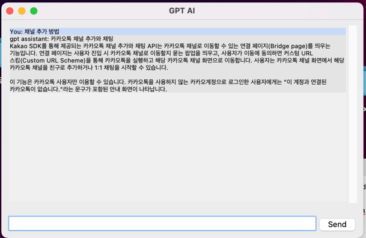

# carrot.w
carrot.w

# output of project 1
## 실행 결과물

## 구현 방식
1. 카카오톡채널.txt 파일 paragraph 분리를 수동으로 진행
2. 각 paragraph 별로 여러개의 keywords를 추출하도록 LLM에 지시
3. 추출한 키워드로 csv 파일 생성
4. 유저 쿼리 입력시 가장 비슷한 keywords를 가지는 paragraph 반환
